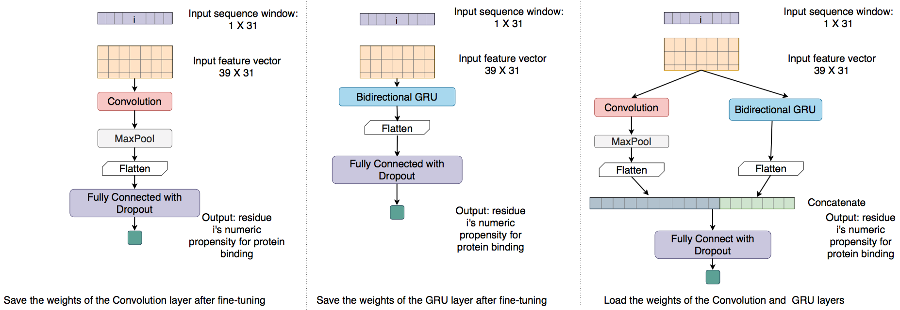
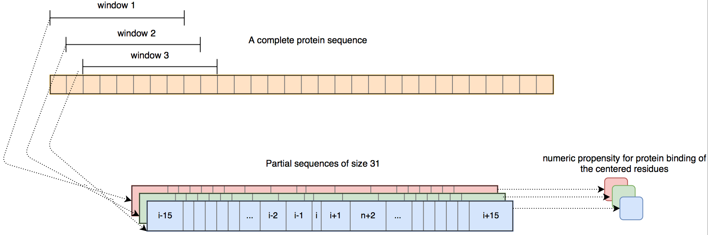

# The source code of DELPHI web server
The DELPHI source code is designed for high-throughput prediction. It does not have the limitation of 10 sequences per run. We recommend to use the [web version](https://www.csd.uwo.ca/~yli922/index.php) of DELPHI if you input is small.
# Citation
Yiwei Li, G. Brian Golding, and Lucian Ilie, DELPHI: accurate deep ensemble model for protein interaction sites prediction. [Bioinformatics](https://doi.org/10.1093/bioinformatics/btaa750), 2020, btaa750

Contact: 

Yiwei Li (yli922@uwo.ca)

Brian Golding (Golding@mcmaster.ca)

Lucian Ilie (ilie@uwo.ca)
# system requirement
DELPHI is developed under Linux environment with python 3.5.
Recommended RAM: > 24GB. The RAM requirement mainly depends on the length of the input sequence. 

# installation
1. clone the source code of DELPHI
```
mkdir -p Src && cd Src
git clone [DELPHI git link]
```
2. install python packages. Python virtual environment or conda is recommended for package management.

``` 
For GPU version:
pip3 install -r requirement_gpu.txt
```

```
For CPU version: 
pip3 install -r requirement_cpu.txt
```

3. install dependencies

```
create a program directory
mkdir -p ../programs && cd ../program
```

 - install [SPRINT](https://github.com/lucian-ilie/SPRINT)
 ```
 git clone https://github.com/lucian-ilie/SPRINT.git
 git checkout DELPHI_Server
 make compute_HSPs_parallel
 ```
 
 - install psiblast: 2.6.0+ and download the corresponding nr database. The database is large. You computing cluster should probaly already have a local copy of it.
 ```
 For Ubuntu:
 sudo apt-get install ncbi-blast+
```
 
 - intall [hh-suite](https://github.com/soedinglab/hh-suite). The [database](http://wwwuser.gwdg.de/~compbiol/data/hhsuite/databases/hhsuite_dbs/old-releases/) used in DELPHI is uniprot20_2015_06.
 
 - intall [GENN+ASAquick](http://mamiris.com/software.html)
 
 - install [ANCHOR](http://anchor.elte.hu/Downloads.php)
 
# Running DELPHI
```
./run_DELPHI.sh [input_sequence]
```

# DELPHI model architecture 



